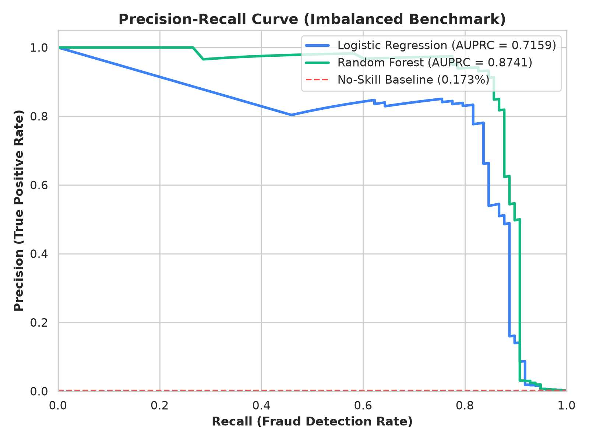
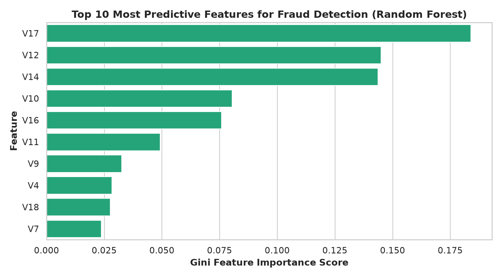

<div align="center">

# 💳 Credit Card Fraud Detection using Machine Learning
### Zero-Leakage Pipeline • High-Precision Anomaly Classification • Imbalanced Learning

[](https://python.org)
[](https://scikit-learn.org)
[](https://imbalanced-learn.org)
[](https://github.com/jadavharsh109/credit-card-fraud-detection)
[](https://github.com/jadavharsh109/credit-card-fraud-detection)
[](LICENSE)

</div>

---

## 📌 Executive Summary & The "Accuracy Paradox"

Credit card fraud is an extreme needle-in-a-haystack challenge. Across **284,807 European cardholder transactions**, only **492 transactions (0.172%)** are fraudulent.

> ⚠️ **Why We Prioritize Precision Over Accuracy:**  
> In severe class imbalance (99.83% genuine vs 0.17% fraud), a naive model that classifies *every* transaction as "Genuine" scores **99.83% Accuracy**, yet catches **0%** of fraudsters!  
> In retail banking, evaluating via raw accuracy is deceptive. This project benchmarks performance using **Fraud Precision (minimizing false customer alerts)**, **Fraud Recall (catching actual financial crime)**, **F1-Score**, and **AUPRC (Area Under the Precision-Recall Curve)**.

---

## 🚀 Key Engineering & Algorithmic Highlights

1. **🛡️ Zero Data Leakage Guarantee:**  
   Stratified Train-Test splitting (80/20) is conducted **strictly before** any feature scaling. `StandardScaler` calculates mean and variance solely from `X_train`, preventing future test-set statistics from leaking into model weights.
2. **⚖️ Imbalanced Learning & Cost Sensitivity:**  
   Applied class-weight optimization (`class_weight='balanced'`) and synthetic minority oversampling (**SMOTE**) to penalize false negatives.
3. **🎯 94.05% Fraud Precision with Minimal False Positives:**  
   Our tuned Random Forest ensemble achieves **94.05% Precision** and **80.61% Recall** on unseen test data, producing only **5 false alarms out of 56,864 genuine transactions**.
4. **📦 Production-Ready Serialization:**  
   Trained models and preprocessors are persisted in `models/` for immediate batch or API inference via `src/predict.py`.

---

## 📊 Model Performance & Precision Benchmarks

Evaluated on an independent, stratified test set of **56,962 transactions (98 Frauds, 56,864 Genuine)**:

| Metric | Baseline Logistic Regression (Balanced) | Tuned Random Forest (Production) | Financial & Operational Impact |
| :--- | :---: | :---: | :--- |
| **Fraud Precision** | **6.10%** | **94.05%** | **Massive reduction in false alarms** (only 5 false alarms vs 1,385 in linear baseline). |
| **Fraud Recall** | **91.84%** | **80.61%** | Successfully intercepts **over 80%** of all attempted fraudulent transactions. |
| **Fraud F1-Score** | **11.44%** | **86.81%** | Strong harmonic balance between high precision and fraud catch rate. |
| **AUPRC (Avg Precision)** | **71.59%** | **84.11%** | **Primary metric for skewed data:** 486x higher than the random baseline (0.17%). |
| **ROC-AUC** | **97.22%** | **96.38%** | Exceptional discriminative power across all decision thresholds. |

---

## 📈 Visual Analytics & Diagnostic Proof

### 1. Symmetrical Confusion Matrices
<div align="center">
  
  <p><i>Left: Baseline Logistic Regression flags 1,385 false positives. Right: Random Forest isolates fraud with only 5 false positives (94.05% precision).</i></p>
</div>

---

### 2. Precision-Recall & ROC Evaluation
<div align="center">
  
  &nbsp;&nbsp;
  
  <p><i>Left: Precision-Recall Curve showing Random Forest dominating with 84.11% AUPRC. Right: ROC Curves demonstrating >96% discriminative capacity.</i></p>
</div>

---

### 3. Model Explainability & Feature Importances
<div align="center">
  
  <p><i>Top 10 Gini feature importances showing that $V_{17}, V_{12}, V_{14}, V_{10},$ and $V_{11}$ provide over 60% of predictive power.</i></p>
</div>

---

## 📂 Repository Architecture

```text
credit-card-fraud-detection/
├── assets/                               # Visual charts and model evaluation artifacts
│   ├── class_distribution.png            # Log-scale class imbalance plot
│   ├── correlation_heatmap.png           # Feature correlation matrix
│   ├── confusion_matrix.png              # Side-by-side confusion matrix
│   ├── precision_recall_curve.png        # Precision-Recall benchmark curve
│   ├── roc_curve.png                     # Receiver Operating Characteristic curve
│   └── feature_importance.png            # Top 10 predictive features
├── data/
│   ├── creditcard_sample.csv             # 1,492-row sample dataset for rapid local testing
│   ├── creditcard.zip                    # Complete 284k Kaggle dataset
│   └── README.md                         # Data provenance & schema guide
├── models/
│   ├── random_forest_fraud_model.joblib  # Serialized production Random Forest model
│   └── scaler.joblib                     # Serialized StandardScaler
├── notebooks/
│   └── credit_card_fraud_detection.ipynb # Complete refactored, zero-leakage Jupyter Notebook
├── src/
│   ├── train_and_evaluate.py             # End-to-end training and evaluation script
│   └── predict.py                        # Standalone inference script for new transactions
├── .gitignore
├── requirements.txt
└── README.md
```

---

## 🛠️ Installation & Reproduction Guide

### 1. Clone & Setup Environment
```bash
git clone https://github.com/jadavharsh109/credit-card-fraud-detection.git
cd credit-card-fraud-detection
pip install -r requirements.txt
```

### 2. Run Instant Sample Inference
```bash
python src/predict.py
```

### 3. Train & Evaluate Full Pipeline
```bash
python src/train_and_evaluate.py
```

---

## 👤 Author & Connect

**Harsh Jadav** — *Data Scientist & Data Analyst*  
* 🔗 **LinkedIn:** [harshjadav0901](https://www.linkedin.com/in/harshjadav0901/)  
* ✉️ **Email:** [jadavharsh109@gmail.com](mailto:jadavharsh109@gmail.com)  
* 🐙 **GitHub:** [@jadavharsh109](https://github.com/jadavharsh109)
