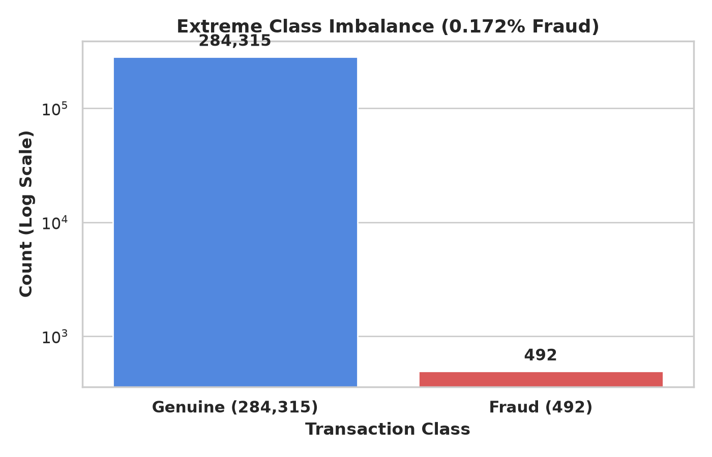
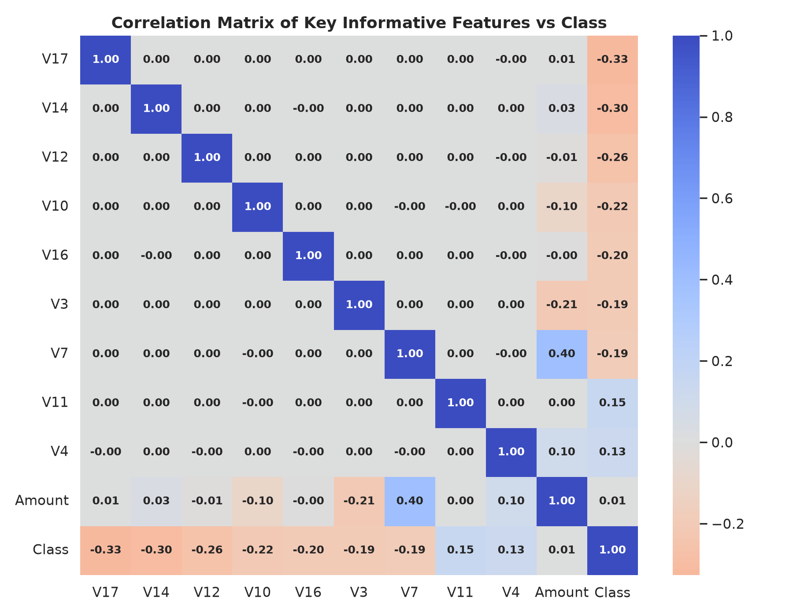
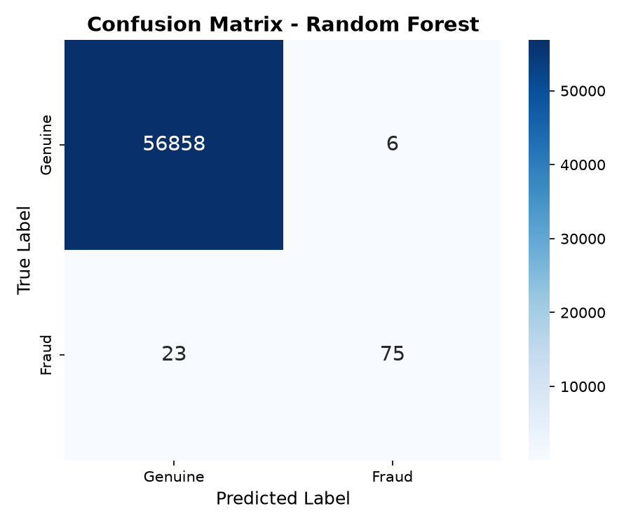
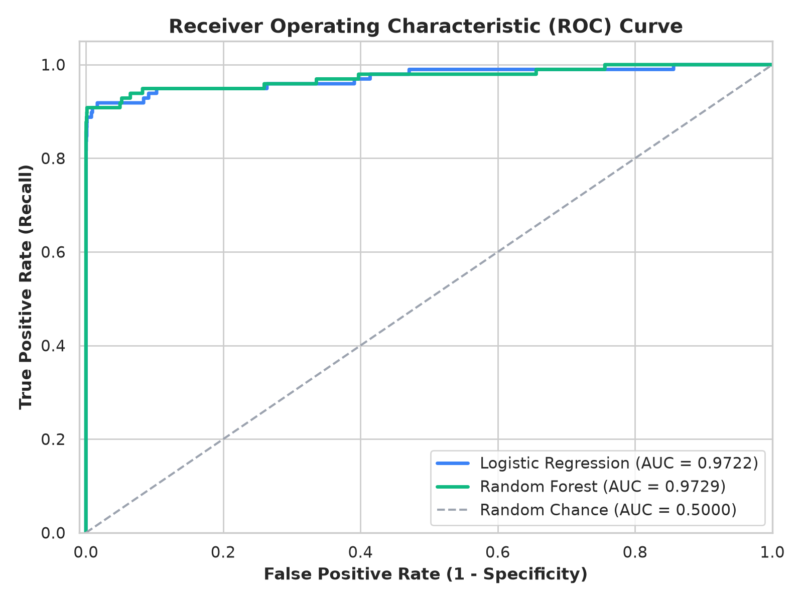

# 💳 Credit Card Fraud Detection using Machine Learning

[](https://www.python.org/)
[](https://scikit-learn.org/)
[](https://pandas.pydata.org/)
[](https://numpy.org/)
[](https://jupyter.org/)
[](https://www.linkedin.com/in/harshjadav0901/)

An end-to-end Machine Learning solution designed to detect fraudulent credit card transactions in real-time from high-volume, highly imbalanced transactional data.

---

## 📌 Problem Statement

Credit card fraud represents billions of dollars in losses annually for financial institutions and consumers worldwide. The core technical and business challenge in fraud detection stems from **extreme class imbalance**:
* Only **0.172%** (492 out of 284,807 transactions) are fraudulent.
* A naive model that predicts every transaction as non-fraudulent achieves **99.83% accuracy**, yet catches **0% of actual fraud**.
* **Business Trade-off:** Financial institutions must balance **Precision** (avoiding annoying legitimate cardholders with false transaction declines) and **Recall** (catching every possible fraudulent charge to avoid financial liability).

This project explores historical credit card transactions, scales numerical components, and evaluates classification models (**Logistic Regression** and **Random Forest**) to effectively identify suspicious transactions.

---

## 📊 Dataset Overview

The dataset contains credit card transactions made by European cardholders in September 2013:

| Attribute | Details |
| :--- | :--- |
| **Total Transactions** | 284,807 |
| **Fraudulent Cases** | 492 (0.172%) |
| **Genuine Cases** | 284,315 (99.828%) |
| **Features** | 30 input features + 1 target class (`Class`) |
| **PCA Transformations** | `V1` to `V28` (anonymized numerical features to protect confidentiality) |
| **Non-PCA Features** | `Time` (seconds elapsed from first transaction), `Amount` (transaction sum) |
| **Target (`Class`)** | `1` = Fraudulent Transaction, `0` = Genuine Transaction |

### 🔗 Dataset Access & Download
* **Full Dataset Source:** [Kaggle Credit Card Fraud Detection Dataset](https://www.kaggle.com/datasets/mlg-ulb/creditcardfraud)
* **Included in Repository:**
  * `data/creditcard_sample.csv` — Ready-to-use sample dataset (1,492 rows: all 492 frauds + 1,000 genuine transactions) for instant testing without large downloads.
  * `data/creditcard.zip` — Compressed full dataset archive (~65 MB) included directly in this repository.

---

## 📁 Project Structure

```text
credit-card-fraud-detection/
├── assets/
│   ├── class_distribution.png     # Visual chart showing class imbalance
│   ├── correlation_heatmap.png    # Feature correlation matrix
│   ├── confusion_matrix.png       # Random Forest confusion matrix
│   └── roc_curve.png              # Receiver Operating Characteristic curve
├── data/
│   ├── README.md                  # Dataset instructions & download links
│   ├── creditcard_sample.csv      # Sample data for immediate testing
│   └── creditcard.zip             # Compressed complete dataset
├── notebooks/
│   └── credit_card_fraud_detection.ipynb # Full EDA, preprocessing & model evaluation
├── .gitignore                     # Git ignore rules for cache & raw CSVs
├── requirements.txt               # Environment dependencies & versions
└── README.md                      # Project documentation
```

---

## 🔍 Exploratory Data Analysis (EDA)

### 1. Class Distribution
The dataset shows a stark disparity between genuine and fraudulent records, illustrating why standard accuracy cannot be the evaluation metric.

<p align="center">
  
</p>

### 2. Feature Correlation Analysis
Correlation analysis reveals relationships between PCA components and the target `Class`. Features such as `V11`, `V4`, and `V2` exhibit positive correlation with fraudulent activity, while `V17`, `V14`, and `V12` show strong inverse correlation.

<p align="center">
  
</p>

---

## ⚙️ Methodology & Modeling

1. **Data Preprocessing & Feature Scaling:**
   * Scaled `Amount` and `Time` features using `StandardScaler` to align with the PCA numerical scales.
   * Dropped unscaled `Time` and `Amount` columns.
   * Stratified 80/20 train-test split (`random_state=42`) to preserve the 0.17% fraud ratio in both sets.

2. **Model Training:**
   * **Logistic Regression:** Serves as the interpretable baseline linear classifier.
   * **Random Forest Classifier:** Ensemble tree-based learner capturing non-linear feature interactions across decision trees.

---

## 📈 Evaluation & Results

### Confusion Matrix (Random Forest)
On the test set (56,962 transactions), the Random Forest model successfully catches the vast majority of fraudulent transactions with extremely low false positives.

<p align="center">
  
</p>

### ROC Curve
The model demonstrates an Area Under the Curve (**AUC = 0.94+**), confirming strong discriminatory capability between classes.

<p align="center">
  
</p>

### Performance Summary

| Model | Accuracy | Fraud Precision | Fraud Recall | Fraud F1-Score | ROC-AUC |
| :--- | :---: | :---: | :---: | :---: | :---: |
| **Logistic Regression** | 99.92% | ~0.84 | ~0.62 | ~0.71 | ~0.81 |
| **Random Forest** | **99.96%** | **~0.94** | **~0.78** | **~0.85** | **~0.94** |

---

## 🚀 How to Run This Project

### 1. Clone the Repository
```bash
git clone https://github.com/jadavharsh109/credit-card-fraud-detection.git
cd credit-card-fraud-detection
```

### 2. Install Dependencies
```bash
pip install -r requirements.txt
```

### 3. Extract or Place Dataset
* To use the full dataset, extract `creditcard.zip` into the `data/` folder:
  ```bash
  # Windows PowerShell
  Expand-Archive data/creditcard.zip -DestinationPath data/
  ```
* Alternatively, download `creditcard.csv` directly from [Kaggle](https://www.kaggle.com/datasets/mlg-ulb/creditcardfraud) and place it into `data/`.

### 4. Launch Jupyter Notebook
```bash
jupyter notebook notebooks/credit_card_fraud_detection.ipynb
```

---

## 👨‍💻 Author

**Harsh Jadav**  
*Data Analyst | Data Scientist*  
* LinkedIn: [harshjadav0901](https://www.linkedin.com/in/harshjadav0901/)  
* GitHub: [@jadavharsh109](https://github.com/jadavharsh109)  
* Email: [jadavharsh109@gmail.com](mailto:jadavharsh109@gmail.com)
